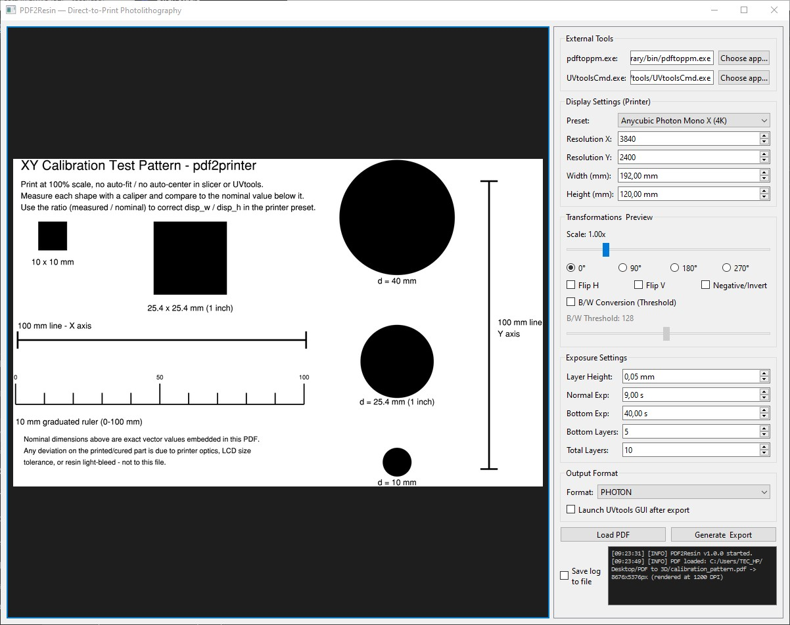

# PDF2Resin

**Direct-to-Print Photolithography Tool**

A lightweight PySide6 desktop application that converts a single-page vector PDF into a native resin-printer exposure file (`.sl1`, `.ctb`, `.photon`, `.goo`, `.cbddlp`, `.phz`), **preserving real physical dimensions**. A 40 mm circle in the PDF will be rendered as a 40 mm circle (a 40 mm cylinder, since the output is a stack of identical layers) on the build plate, independent of the printer brand or LCD resolution.

This tool is specifically designed for **flat masked-exposure workflows** (PCB exposure, stencils, UV curing masks, resin test patterns) where every layer of the output is the same image repeated *N* times, rather than a sliced 3D model.

---

## 🛠️ How It Works

1. **High-Resolution Rasterization**: Renders the first page of the input PDF to a high-resolution raster image using `pdftoppm` (from Poppler). The rendering DPI is dynamically calculated based on the target printer's pixel density to prevent aliasing.
2. **Physical Scaling**: Computes the exact pixel size needed on the target printer's LCD from the printer's real display dimensions (`disp_w` / `disp_h` in mm) and resolution (`res_x` / `res_y` in px). Scale, rotation, flipping, inversion, and B/W thresholding are applied in physical units, not arbitrary pixels.
3. **SL1 Archive Generation**: Centers the result on a canvas matching the printer's native resolution and builds a valid `.sl1` archive. Layer height, normal/bottom exposure times, bottom layer count, and the total number of repeated layers are fully configurable.
4. **Format Conversion (Optional)**: If the target format isn't `.sl1`, the tool hands the generated `.sl1` file off to [UVtools](https://github.com/sn4k3/UVtools) (`UVtoolsCmd`) to produce the printer-native file.

---

## 📦 Requirements

- **Python 3.9+**
- **Python Libraries**: [PySide6](https://pypi.org/project/PySide6/) and [Pillow](https://pypi.org/project/Pillow/)  
  `pip install PySide6 Pillow`
- **Poppler** (`pdftoppm` executable): Used for high-DPI PDF rasterization.
  - *Windows*: Download a Poppler build (e.g., from [oschwartz10612/poppler-windows](https://github.com/oschwartz10612/poppler-windows/releases)) and point the app to `pdftoppm.exe`.
  - *Linux*: `sudo apt install poppler-utils`
  - *macOS*: `brew install poppler`
- **UVtools** (`UVtoolsCmd` / `UVtoolsCmd.exe`): Required *only* if exporting to a format other than `.sl1` (CTB, PHOTON, GOO, CBDDLP, PHZ). Not needed if you only ever export `.sl1`.

> **Note:** Both external tool paths are set once in the GUI and persisted between sessions.

---

## 🚀 Usage

1. Launch the app: `python pdf2resin.py`
2. Point it to your `pdftoppm` and (optionally) `UVtoolsCmd` executables.
3. Pick a printer preset (or enter custom resolution/display size).
4. Load your PDF.
5. Adjust scale, rotate, flip, invert, and B/W threshold as needed.
6. Set exposure and layer parameters (Bottom Layers, Total Layers, etc.).
7. Choose the output format and click **Generate & Export**.

---

## 📋 Supported Output Formats & Encoders

| Format | UVtools Strict Encoder | Notes |
| :--- | :--- | :--- |
| **SL1** | `sl1` | Written directly. No UVtools call needed. |
| **CTB** | `chitubox` | `.ctb` is shared by multiple encoders in UVtools; the strict name must be used. |
| **PHOTON** | `chitubox` | `.photon` belongs to the Chitubox encoder, *not* `AnycubicPhotonS` (which produces `.photons`). |
| **GOO** | `goov5` | Goo format v5. |
| **CBDDLP** | `chitubox` | Handled by the Chitubox encoder. |
| **PHZ** | `phz` | Phrozen format. |

> ⚠️ **Important:** If you add support for another format, verify the exact strict encoder name by running `UVtoolsCmd convert` with no arguments. It lists all valid encoder names and the extensions each one accepts. Never assume the encoder name matches the file extension.

---

## 📏 XY Calibration (Crucial for Photolithography)

This tool computes pixel sizes from the *nominal* display dimensions of your printer (from the preset or your custom values). It **cannot** know:
1. The real, as-manufactured size of your specific LCD panel (datasheet values have manufacturing tolerances, typically ±0.1–0.5%).
2. Your resin's UV light-bleed / overcure margin, which depends on resin, exposure time, and layer height, and always grows the cured part slightly beyond the mask.

Therefore, a 40 mm circle in the source PDF will not automatically print as a physically exact 40 mm cylinder. It will be offset by whatever your printer + resin + exposure settings add or remove.

The included `calibration_pattern.pdf` exists to measure and correct that offset:
1. Load `calibration_pattern.pdf` in the app, using your real printer preset and exposure settings.
2. Export and print it as-is (100% scale, no auto-fit/auto-center).
3. Measure the printed shapes with a caliper (the 100 mm line and the graduated ruler are the most sensitive to read).
4. Compute `correction = measured_mm / nominal_mm`.
5. Multiply your printer preset's `disp_w` / `disp_h` by that factor (increase them if the print came out larger than nominal, decrease if smaller) and save it as a **Custom** preset.
6. Repeat whenever you change resin brand or exposure profile, since light-bleed compensation is resin- and settings-dependent.

---

## ⚠️ Known Limitations

- **Single-page PDFs only**: Only the first page of the input PDF is processed.
- **Identical layers**: All output layers are identical copies of the same rendered image. This tool does *not* slice a 3D model.
- **GUI Thread Blocking**: Conversion runs on the main GUI thread. For very large files or high layer counts on 12K+ printers, the window may become briefly unresponsive during export.

---

## 📄 License

This project is licensed under the **GNU General Public License v3.0** (GPL-3.0).  
See the [LICENSE](LICENSE) file for details.

---

## 🤝 Contributing

Contributions, issues, and feature requests are welcome! Feel free to check the [issues page](https://github.com/your-username/pdf2resin/issues).
